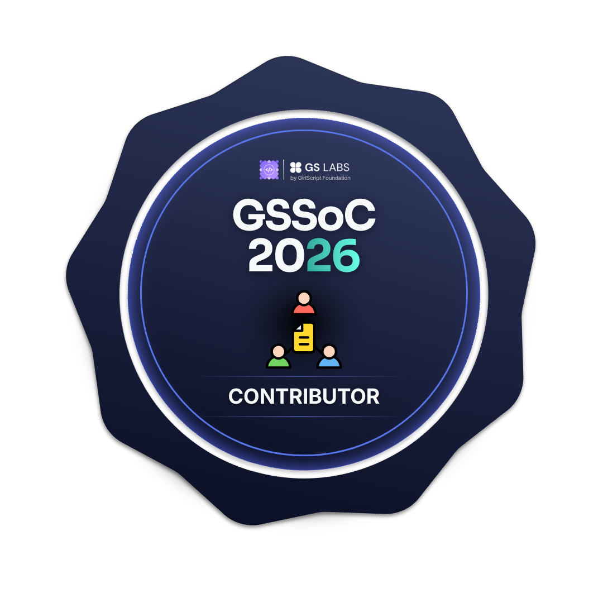
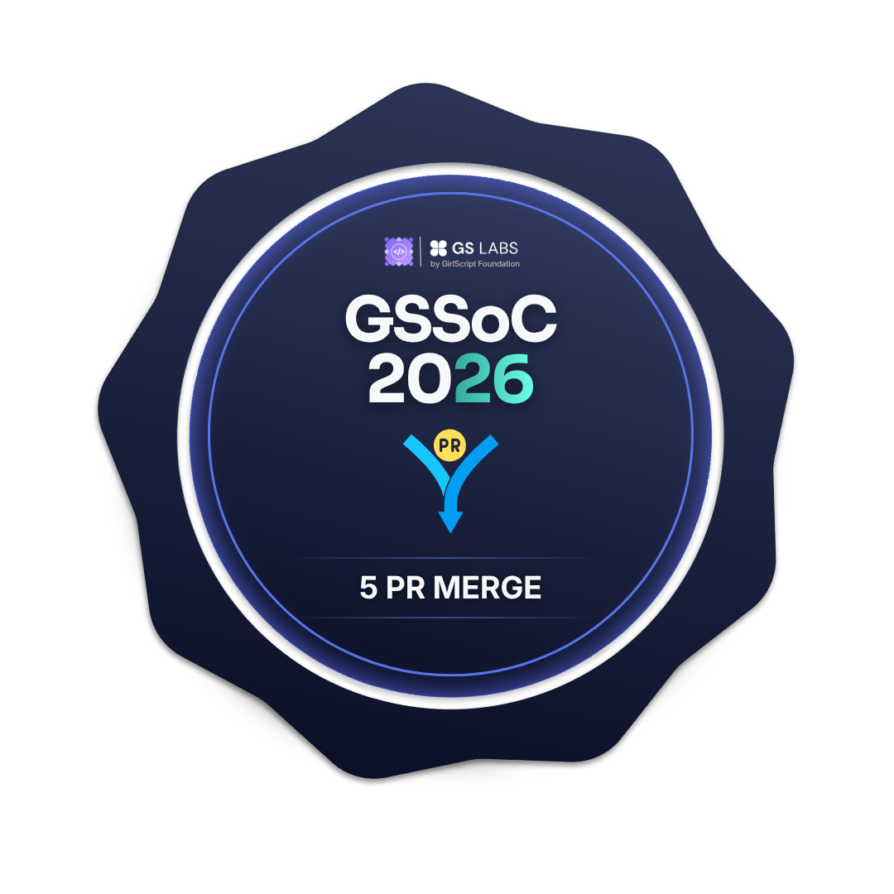

<p align="center">
  
</p>

<h1 align="center" style="margin-top: -3px; font-size: 2.8rem; font-weight: bold; letter-spacing: 1px;">
  Shanidhya Kumar
</h1>

<h3 align="center">
  
</h3>

<p align="center">
  <b>🎓 B.E. Computer Science & Engineering (IoT & Cyber Security)</b><br>
  <i>Dayananda Sagar College Of Engineering | Bangalore, India</i>
</p>

<div align="center">

[](mailto:luckykumar0011s@gmail.com)
[](https://leetcode.com/u/luckykumar0011s/)
[](https://github.com/Shanidhya01)
[](https://www.linkedin.com/in/shanidhya-kumar/)
[](https://github.com/Shanidhya01?tab=repositories)

</div>

<p align="center">
  <a href="https://github.com/Shanidhya01?tab=followers">
    
  </a>
  <a href="https://github.com/Shanidhya01?tab=stars">
    
  </a>
  
</p>

<br>

<div align="center">

### 🏅 Open Source Badges

#### Hacktoberfest / Holopin


#### GSSoC 2026






</div>


## 📚 Table of Contents

<div align="center">

**[About Me](#-about-me)** • **[Highlights](#-highlights)** • **[Tech Stack](#-tech-stack)** • **[GitHub Stats](#-github-stats--activity)** • **[Projects](#-all-projects)** • **[Achievements](#-achievements--certifications)** • **[Contact](#-contact-me)**

</div>


## 🧑‍💻 About Me


- 🎓 **3rd year B.E.** in Computer Science & Engineering (IoT & Cyber Security)
- 🌏 **Based in** Bangalore, India
- 👨‍💻 **Competitive coder** who enjoys crafting clean, readable code
- 💻 **Building** full-stack applications, AI-powered tools & microservices
- 🚢 **Shipped 27+ projects** across web, AI, real-time, and DevOps domains
- 📬 **Contact:** [luckykumar0011s@gmail.com](mailto:luckykumar0011s@gmail.com) | [+91 9905583008](tel:+919905583008)

<br>

### 🔭 Currently

- **Learning:** System Design, DevOps, Docker, CI/CD
- **Building:** BuildScope (AI microservices), Tracktern (job tracker), Guessync (multiplayer game)
- **Practicing:** DSA in C++ and problem-solving patterns
- **Contributing:** GSSoC, open source projects, and component libraries

<br clear="right"/>


## 🚀 Highlights

<div align="center">

|  🔢  | Metric                      | Value                                                  |
| :--: | :-------------------------- | :----------------------------------------------------- |
|  📦  | **Projects Shipped**  | **27+** full-stack applications                  |
|  🤖  | **AI-Powered Apps**   | **8+** projects using Gemini, OpenAI, OpenRouter |
|  ⚡  | **Real-Time Apps**    | **5+** with Socket.io & WebSockets               |
| 🏗️ | **Microservices**     | BuildScope — Docker + API Gateway architecture        |
|  🧩  | **VS Code Extension** | CodeInSight — AI code reviewer                        |
|  🎮  | **3D / Interactive**  | Three.js Solar System, AlgoFlowX visualizer            |

</div>

<div align="center">

```yaml
Core Strengths:
  🛠️ Full-Stack: React, Next.js, TypeScript, Node.js, Express, MongoDB, PostgreSQL
  ⚡ Real-Time: Socket.io, WebSockets, live collaboration
  🔐 Security: JWT, bcrypt, Clerk, Firebase Auth, encryption
  🐳 DevOps: Docker, Vercel, Netlify, Render, CI/CD ,Jenkins, Aws
  📊 Data: Prisma ORM, Mongoose, Recharts, PDF generation
```

</div>


## 🧰 Tech Stack

<p align="center">
  
</p>

<details>
<summary><b>🔽 See detailed tech badges</b></summary>

### Languages


### Frontend


### Backend


### Database & ORM


### AI & APIs


### Auth


### DevOps & Deployment


</details>


## 📈 GitHub Stats & Activity

<p align="center">
  
</p>

<p align="center">
  
  
</p>

<p align="center">
  
  
</p>

<p align="center">
  <a href="https://github.com/Shanidhya01/github-readme-activity-graph">
    
  </a>
</p>

<p align="center">
  
</p>

<p align="center">
  
  
</p>


## 📌 Pinned Repositories

<table align="center">
  <tr>
    <td>
      <a href="https://github.com/Shanidhya01/BuildScope">
        
      </a>
    </td>
    <td>
      <a href="https://github.com/Shanidhya01/AXIONYX">
        
      </a>
    </td>
  </tr>
  <tr>
    <td>
      <a href="https://github.com/Shanidhya01/CodeInSight">
        
      </a>
    </td>
    <td>
      <a href="https://github.com/Shanidhya01/Journyzer">
        
      </a>
    </td>
  </tr>
</table>


## 🎯 All Projects

### 🤖 AI-Powered Applications

<table align="center">
  <tr>
    <th>Project</th>
    <th>Description</th>
    <th>Tech Stack</th>
  </tr>
  <tr>
    <td><a href="https://github.com/Shanidhya01/BuildScope"><b>🏗️ BuildScope</b></a></td>
    <td>AI microservices platform — converts plain-English ideas into structured project blueprints</td>
    <td></td>
  </tr>
  <tr>
    <td><a href="https://github.com/Shanidhya01/CodeInSight"><b>🔧 CodeInSight</b></a></td>
    <td>AI-powered code review app + VS Code extension with editor UI</td>
    <td></td>
  </tr>
  <tr>
    <td><a href="https://github.com/Shanidhya01/Journyzer"><b>🗺️ Journyzer</b></a></td>
    <td>AI travel planner — personalized, budget-aware, day-wise itineraries with PDF export</td>
    <td></td>
  </tr>
  <tr>
    <td><a href="https://github.com/Shanidhya01/VOICE-ASSISTANT"><b>🎙️ AI Assistant</b></a></td>
    <td>Voice-controlled AI assistant with cyberpunk UI & real-time speech recognition</td>
    <td> + Gemini API</td>
  </tr>
  <tr>
    <td><a href="https://github.com/Shanidhya01/AI-ChatBot"><b>💬 AI ChatBot</b></a></td>
    <td>Real-time AI chat interface with dark/light mode & glassmorphism UI</td>
    <td> + Gemini API</td>
  </tr>
  <tr>
    <td><a href="https://github.com/Shanidhya01/Tracktern"><b>📋 Tracktern</b></a></td>
    <td>Smart job/internship tracker with AI-powered insights & reminders</td>
    <td></td>
  </tr>
  <tr>
    <td><a href="https://github.com/Shanidhya01/readme-generator"><b>📝 README Generator</b></a></td>
    <td>Auto-generate polished README files for GitHub repositories</td>
    <td></td>
  </tr>
</table>

### ⚡ Real-Time & Multiplayer

<table align="center">
  <tr>
    <th>Project</th>
    <th>Description</th>
    <th>Tech Stack</th>
  </tr>
  <tr>
    <td><a href="https://github.com/Shanidhya01/Guess"><b>🎮 Guessync</b></a></td>
    <td>Real-time multiplayer music guessing game with AI hints, Spotify & YouTube</td>
    <td></td>
  </tr>
  <tr>
    <td><a href="https://github.com/Shanidhya01/BlinkChat"><b>💬 BlinkChat</b></a></td>
    <td>Real-time chat app with DM, online status & cloud image uploads</td>
    <td></td>
  </tr>
  <tr>
    <td><a href="https://github.com/Shanidhya01/AXIONYX"><b>🎓 AXIONYX</b></a></td>
    <td>Student productivity platform — attendance, assignments, career tracking, real-time chat</td>
    <td></td>
  </tr>
</table>

### 🛒 Full-Stack Web Applications

<table align="center">
  <tr>
    <th>Project</th>
    <th>Description</th>
    <th>Tech Stack</th>
  </tr>
  <tr>
    <td><a href="https://github.com/Shanidhya01/Shoporia"><b>🛒 Shoporia</b></a></td>
    <td>E-Commerce platform with cart, orders, Stripe payments & admin dashboard</td>
    <td></td>
  </tr>
  <tr>
    <td><a href="https://github.com/Shanidhya01/Leetify"><b>🔍 Leetify</b></a></td>
    <td>LeetCode-style coding platform with in-browser Monaco code editor</td>
    <td></td>
  </tr>
  <tr>
    <td><a href="https://github.com/Shanidhya01/SecureShare"><b>🔐 SecureShare</b></a></td>
    <td>Secure file sharing — encryption, time-limited/one-time downloads, audit logs</td>
    <td></td>
  </tr>
  <tr>
    <td><a href="https://github.com/Shanidhya01/WriteWave"><b>✍️ WriteWave</b></a></td>
    <td>Full-stack blog platform with rich text editing & user auth</td>
    <td></td>
  </tr>
  <tr>
    <td><a href="https://github.com/Shanidhya01/Resume-Builder"><b>📄 Resume Builder</b></a></td>
    <td>Customizable resume builder with live preview, templates & PDF export</td>
    <td></td>
  </tr>
  <tr>
    <td><a href="https://github.com/Shanidhya01/BookVault"><b>📚 BookVault</b></a></td>
    <td>Library management — borrowing, waitlists, overdue reminders, admin dashboard</td>
    <td></td>
  </tr>
  <tr>
    <td><a href="https://github.com/Shanidhya01/Expense-Tracker"><b>💰 Expense Tracker</b></a></td>
    <td>Income/expense tracker with data visualization & Excel export</td>
    <td></td>
  </tr>

### 🎨 SaaS, Tools & Visuals

<table align="center">
  <tr>
    <th>Project</th>
    <th>Description</th>
    <th>Tech Stack</th>
  </tr>
  <tr>
    <td><a href="https://github.com/Shanidhya01/Cloudinary-Saas"><b>☁️ AI Cloudinary SaaS</b></a></td>
    <td>SaaS platform for image/video upload, transformation & social sharing</td>
    <td> + Clerk, Cloudinary</td>
  </tr>
  <tr>
    <td><a href="https://github.com/Shanidhya01/AlgoFlowX"><b>📊 AlgoFlowX</b></a></td>
    <td>Interactive step-by-step algorithm visualizer — sorting, searching, graphs, DP</td>
    <td></td>
  </tr>
  <tr>
    <td><a href="https://github.com/Shanidhya01/3-D-Solar-System"><b>🪐 3D Solar System</b></a></td>
    <td>3D solar system simulation with interactive camera & speed controls</td>
    <td></td>
  </tr>
  <tr>
    <td><a href="https://github.com/Shanidhya01/MOVIE-HUB"><b>🎬 Movie Hub</b></a></td>
    <td>Browse movies, anime & TV shows with trailers</td>
    <td></td>
  </tr>
  <tr>
    <td><a href="https://github.com/Shanidhya01/StackFlow-Appwrite"><b>🔗 Stackflow</b></a></td>
    <td>Next.js template with Stackflow navigation & Appwrite BaaS</td>
    <td></td>
  </tr>
</table>

<div align="center">

**[📂 View all repositories →](https://github.com/Shanidhya01?tab=repositories)**

</div>


|  🏆  | Achievement             | Detail                                                             |
| :--: | :---------------------- | :----------------------------------------------------------------- |
|  💻  | **LeetCode**      | Rank 51,622 —[View Profile](https://leetcode.com/u/luckykumar0011s/) |
| 🛡️ | **Cisco**         | Cybersecurity Essentials                                           |
|  📜  | **JavaScript**    | Fundamentals Certification                                         |
|  🐍  | **Python**        | Programming Certification                                          |
|  📬  | **Postman**       | API Testing Certification                                          |
|  🤖  | **AI/ML**         | AI Foundation & Machine Learning                                   |
|  🏅  | **Hacktoberfest** | Level 5 Contributor (Holopin badges)                               |
|  🌟  | **GSSoC**         | GirlScript Summer of Code contributor                              |
|  🚢  | **Open Source**   | 27+ repositories, active contributor                               |

</div>


## 🌐 Industry Exposure

<div align="center">

### 📱 Nokia Technology Visit


**Attended tech session learning about:**

- 🤖 AI & Machine Learning Applications
- 📡 5G/6G Network Trials
- 🌐 IoT Innovations
- 🤝 Networked with Industry Professionals

</div>


## 🔥 What I'm Working On


- 🏗️ **BuildScope** — AI microservices with Docker & API Gateway
- 📋 **Tracktern** — Smart job tracker with AI insights
- 🎮 **Guessync** — Multiplayer music guessing game
- 🥇 Regular participant in coding contests (LeetCode, Codeforces)
- 🤝 Open to collaboration on full-stack, AI/ML, GSSoC, and open source
- 🎯 **Goal:** Contribute to major open source projects & build impactful products

<br clear="right"/>


## 📬 Contact Me

<div align="center">

<a href="mailto:luckykumar0011s@gmail.com">
  
</a>
<a href="https://www.linkedin.com/in/shanidhya-kumar/">
  
</a>
<a href="https://github.com/Shanidhya01">
  
</a>
<a href="https://leetcode.com/u/luckykumar0011s/">
  
</a>
</div>


<br>
<div align="center" style="margin-top: 32px;">
  
  <br>
  <i>Open for internships, collaborations, and exciting projects!</i>
</div>


</div>
